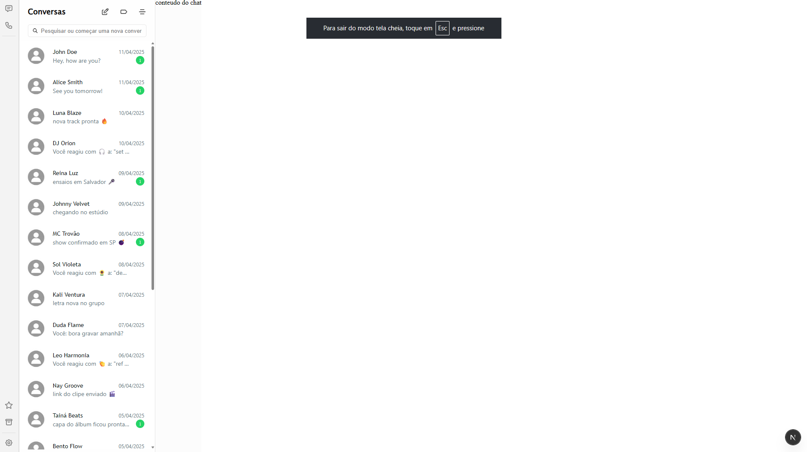

# WhatsClone

This is a [Next.js](https://nextjs.org) project bootstrapped with [`create-next-app`](https://nextjs.org/docs/app/api-reference/cli/create-next-app).



## Getting Started

First, run the development server:

```bash
npm run dev
# or
yarn dev
# or
pnpm dev
# or
bun dev
```

Open [http://localhost:3000](http://localhost:3000) with your browser to see the result.

## Planned Improvements

### Authentication & Security

- Implement proper authentication system using NextAuth.js
- Add login/register forms with validation
- Implement session management
- Add security headers and CORS policies
- Implement rate limiting
- Add input sanitization

### State Management & Data Flow

- Add Redux Toolkit or Zustand for state management
- Implement real-time WebSocket communication
- Create proper API structure
- Add API route handlers

### TypeScript & Code Quality

- Enhanced TypeScript interfaces
- Improved type safety across components
- Better error handling
- Component library with style guide

### UI/UX Improvements

- Implement responsive design
- Add dark mode support
- Create theme system
- Optimize styling with CSS-in-JS or Tailwind CSS
- Add loading states and error boundaries

### Testing & Quality Assurance

- Unit tests with Jest
- E2E tests with Cypress/Playwright
- API integration tests
- Performance testing

### Performance Optimization

- Image optimization
- Component lazy loading
- Bundle size optimization
- Caching strategies

### DevOps & Deployment

- Complete Docker configuration
- Multi-stage build optimization
- Production deployment pipeline
- Environment management

### Core Features

- Real-time chat functionality
- File sharing capabilities
- User profiles
- Group chat support
- Message search
- Message reactions and replies

## Project Structure

```
src/
├── app/          # Next.js app router
├── components/   # Reusable components
├── constants/    # Application constants
├── interfaces/   # TypeScript interfaces
└── mock/        # Mock data for development
```

## Learn More

To learn more about Next.js, take a look at the following resources:

- [Next.js Documentation](https://nextjs.org/docs)
- [Learn Next.js](https://nextjs.org/learn)

## Deploy on Vercel

The easiest way to deploy your Next.js app is to use the [Vercel Platform](https://vercel.com/new?utm_medium=default-template&filter=next.js&utm_source=create-next-app&utm_campaign=create-next-app-readme) from the creators of Next.js.

Check out our [Next.js deployment documentation](https://nextjs.org/docs/app/building-your-application/deploying) for more details.
